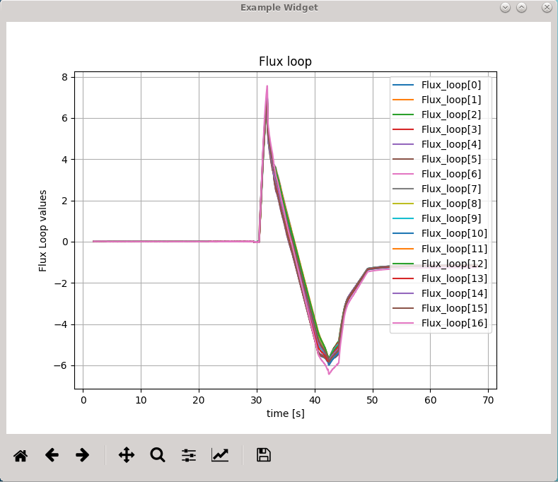
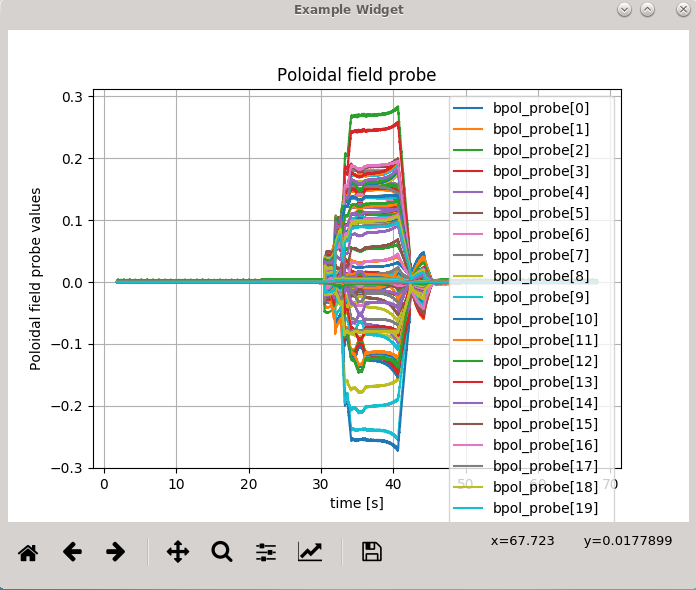
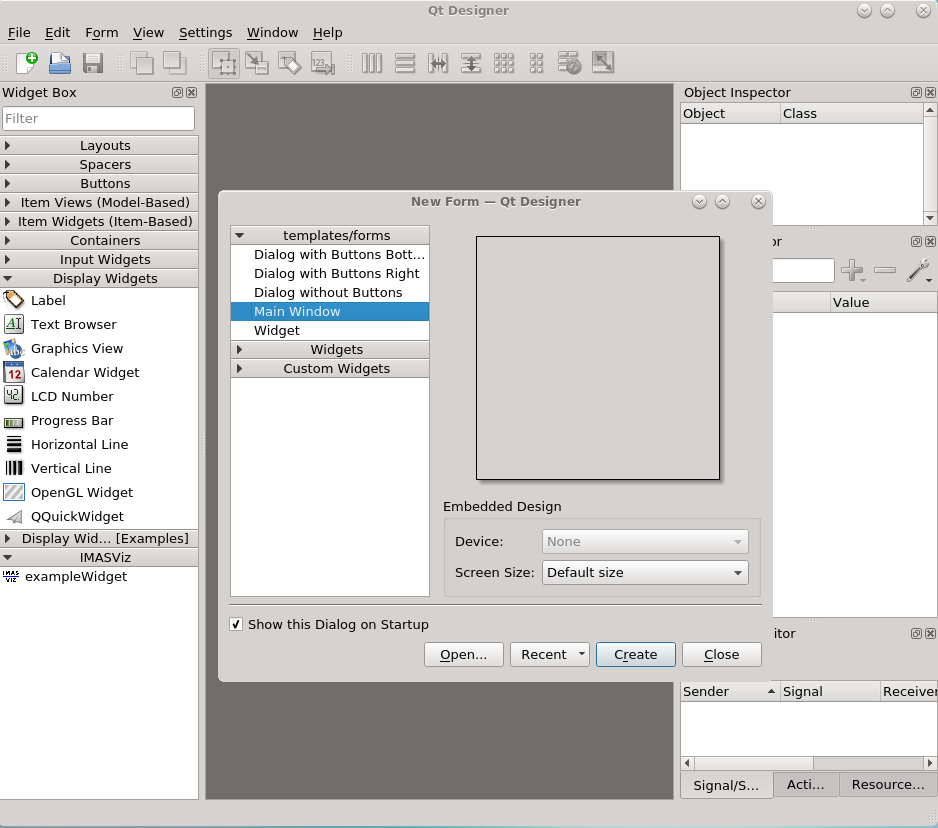
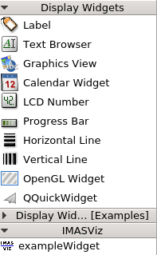

.. _plugins_qtdesigner:

Developing a custom user interface (UI) plugins with Qt designer
================================================================

**Qt Designer** is a tool for designing and building **Qt-based graphical user**
**interfaces**. It allows the user to design custom widgets, dialogs, main
windows etc. using on-screen forms and a user-friendly simple drag-and-drop
interface. It also provides the user with a convenient ability to preview the
designs to ensure they work as intended.

In general, Qt Designer mainly offers basic QT widgets such as Push Button,
Line Edit, List Widget etc. This list of the QT Designer widgets can be extended
by writing so-called **Qt designer plugins** (do not confuse with
**IMASViz plugins**!). Normally this is done using C++ but PyQt5 also allows
you to write QT Designer plugins in Python.

Most of the time such designer plugin is used to expose a custom widget
(written in Python) to QT Designer so that it appears in Designer’s widget box
just like any other widget. It is possible to change the widget’s properties
and to connect its signals and slots.

.. note::
   For more information on QT Designer and PyQt5 based plugins and widgets
   check `this link <http://pyqt.sourceforge.net/Docs/PyQt5/designer.html>`_.

In this HOWTO section it will be described how to:
  #. How to develop a **custom PyQt5 widget**
  #. How to expose the **custom PyQt5 widget** class to **Qt designer** as a
     **Qt designer plugin**
  #. How to use the **custom PyQt5 widget** as a **Qt designer plugin** within
     the Qt Designer
  #. How to design of a custom **user interface (UI) plugin** (which includes
     the custom **Qt designer plugin**) with Qt designer
  #. How to use the **UI plugin** in a standalone way as a
     **PyQt5 application**
  #. How to use the **UI plugin** in **IMASViz**

.. Warning::
   Qt version of used PyQt5 (compiled with Qt) and Qt designer must match!

As the main example to work with, the **Magnetics IDS overview Plugin**, also
referred to as **Example Plugin** (made especially for the purposes of this
HowTo manual section), will be used.

Below is a short demonstration video of **SOLPS overview Plugin**, showing an
example of the processes listed in points **3-6**. More on this plugin (as
IMASViz plugin) can be found in section :ref:`IMASViz_plugins`.

.. only:: html

   .. raw:: html

      <video controls width="600" src="../_static/QtDesigner_and_IMASViz_plugin_short_demo.mp4"></video>

.. only:: latex

   .. TODO: requires the .mp4 file to be in the same directory as the .pdf file

   `Local Video Link <QtDesigner_and_IMASViz_plugin_short_demo.mp4>`_.

Developing custom PyQt5 widget
------------------------------

This section describes and demonstrates how to write a complete custom PyQt5
widget dealing with the data stored within the **Magnetics IDS**. The same
widget will be then used to create **Magnetics IDS overview Plugin** using Qt
designer.

In the end, the main features of this custom plugin are:
- **Opening and reading an IDS** for the set case parameters **OR**
**reading the IDS which was passed by the application**, and
- convenient plotting of all **flux_loop** and **poloidal field probe** signals
found in the **Magnetics IDS** (arrays of values).

In this case, the whole code is written in **exampleWidget.py** Python file.

The final code can be already
observed and compared here: :ref:`exampleWidget_code`.

.. Note::
   It is recommended to have the finished code opened on the side while going
   through this tutorial for a better overall understanding of this section.

.. Note::
   It is recommended to have at least some basic knowledge from programming
   (especially with Python programming language) before proceeding with the widget
   development instructions. A complete beginner might find those instructions
   a bit overwhelming.

This section is split into the next subsections:

  #. Code header
  #. Import statements
  #. Widget Class definition
      #. Widget Constructor definition
      #. Widget base "set" and "get" routines
      #. Widget custom routines
  #. PlotCanvas Class definition
      #. PlotCanvas Constructor definition
      #. PlotCanvas custom plotting routines
  #. Running the code as the main program (standalone)

Code header
^^^^^^^^^^^

The header of the custom PyQt5 widget .py source file should contain some basic
information about the code:
- the .py filename,
- short description what the script is used for,
- author name and
- authors contact (e-mail is most convenient).

.. literalinclude:: ../../../imasviz/VizPlugins/viz_example/exampleWidget.py
   :language: python
   :lineno-start: 1
   :lines: 1-16
   :linenos:

Documentation should be as important to a developer as all other facets of
development. **Every code should include documentation** (in the forms of a
header, code comments etc.). It either explains what the code does, how it
operates, how to use it etc. Documentation is an important part of software engineering.

No matter what the code contains, chances are that someday other
users will try to understand and use it. Even code authors don't remember
everything they've done after just a few weeks after the last time they worked
on the code in question.

Taking that extra time to write a proper description of the contents of the
code will save huge amounts of time and effort for everybody to understand the
code.

.. _plugins_qtdesigner_import_statement:

Import statements
^^^^^^^^^^^^^^^^^

The custom PyQt5 widget requires additional sources - modules.

The ones required are:

Common system and OS modules:

.. literalinclude:: ../../../imasviz/VizPlugins/viz_example/exampleWidget.py
   :language: python
   :lineno-start: 18
   :lines: 18-21
   :linenos:

PyQt5 modules:

.. literalinclude:: ../../../imasviz/VizPlugins/viz_example/exampleWidget.py
   :language: python
   :lineno-start: 22
   :lines: 22-24
   :linenos:

Matplotlib modules and setting matplotlib to use the Qt rendering:

.. literalinclude:: ../../../imasviz/VizPlugins/viz_example/exampleWidget.py
   :language: python
   :lineno-start: 25
   :lines: 25-30
   :linenos:
   :emphasize-lines: 3

IMAS modules:

.. literalinclude:: ../../../imasviz/VizPlugins/viz_example/exampleWidget.py
   :language: python
   :lineno-start: 31
   :lines: 31-32
   :linenos:

Widget
^^^^^^

This section describes and demonstrates how to define a new widget class in
Python3.

Class definition
""""""""""""""""

One of the main parts of this code is the definition of a new class inheriting
from the PyQt5 **QWidget** class. In this case, we label our class as
**example Widget**.

This class defined the QWidget (contents, design, functions related to the
widget etc.).

.. literalinclude:: ../../../imasviz/VizPlugins/viz_example/exampleWidget.py
   :language: python
   :lineno-start: 34
   :lines: 34-37
   :linenos:

.. note::
   Do not forget to describe the class - what is its purpose etc.

Here also a new PyQt signal is set, which will be used later in code and when
running the plugin.

.. literalinclude:: ../../../imasviz/VizPlugins/viz_example/exampleWidget.py
   :language: python
   :lineno-start: 39
   :lines: 39-40
   :linenos:

In short, the signal on its own does not perform any action. Instead, it is
``connected`` to a ``slot``. The slot can be any callable Python function.
When the signal gets emitted the connected slot (Python function) gets called.

.. note::
   More on signal and slots:
   `Link <https://www.tutorialspoint.com/pyqt/pyqt_signals_and_slots.html>`_

Constructor definition
""""""""""""""""""""""

Constructors are generally used for instantiating an object. The task of
constructors is to initialize (assign values) to the data members of the
class when an object of the class is created.

In case of this custom widget, the constructor takes additional arguments:
- :guilabel:`parent` (can be either Qt object, later our case QMainWindow), and
- :guilabel:`ids` (an IDS object).

Both arguments are set as **None** (default values).

.. literalinclude:: ../../../imasviz/VizPlugins/viz_example/exampleWidget.py
   :language: python
   :lineno-start: 42
   :lines: 42-55
   :linenos:

And the **ids** object is set with:

.. literalinclude:: ../../../imasviz/VizPlugins/viz_example/exampleWidget.py
   :language: python
   :lineno-start: 63
   :lines: 63-65
   :linenos:

Regarding the **ids** object, the main idea is to make our widget capable of
performing in two different ways. Either:

  - use IDS object passed to the widget (in which case **ids != None**),
  - if no IDS object was passed (**ids == None**), open IDS and create a new
    **ids** object.

For example, in **IMASViz** there is and IDS open and thus have the **ids**
object available. Instead of opening the IDS again, the **ids** object can be
just passed to the custom widget as an argument and the widget can continue to
use it.

If there is no IDS object already available (meaning no IDS is already being
read), it should be created/opened. In constructor we define a dictionary
labeled **self.idsParameters** which should contain all IDS parameters for IDS
(will be used later to open the correct IDS):

.. literalinclude:: ../../../imasviz/VizPlugins/viz_example/exampleWidget.py
   :language: python
   :lineno-start: 67
   :lines: 67-81
   :linenos:

Constructor should contain also a check if the widget is being run in a desktop
environment. As this is a widget which deals with GUI and visualization this is
mandatory. The code should not be run from a "terminal-only" environment (for
example ``ssh user@host`` etc.).

In this case we define a **checkDisplay()** function:

.. literalinclude:: ../../../imasviz/VizPlugins/viz_example/exampleWidget.py
   :language: python
   :lineno-start: 172
   :lines: 172-177
   :linenos:

and add its execution to the constructor:

.. literalinclude:: ../../../imasviz/VizPlugins/viz_example/exampleWidget.py
   :language: python
   :lineno-start: 59
   :lines: 59-61
   :linenos:

Lastly, we define the default layout of our widget and its contents (plot canvas and
matplotlib navigation toolbar):

.. note::
   The **PlotCanvas** class and its routines definition will be done in the
   later sections.

.. literalinclude:: ../../../imasviz/VizPlugins/viz_example/exampleWidget.py
   :language: python
   :lineno-start: 83
   :lines: 83-91
   :linenos:

Base "set" and "get" routines
"""""""""""""""""""""""""""""

For setting and getting/returning the IDS case parameters, a set of **set/get**
routines must be defined.

The **set** routines must be set as **slots (@pyqtSlot)**. This clearly marks
the function as a slot for PyQt5. This also increases the speed and performance
while executing the functions as slots in PyQt5 applications.

The **get** routines are simple functions which return the variable value.

.. literalinclude:: ../../../imasviz/VizPlugins/viz_example/exampleWidget.py
   :language: python
   :lineno-start: 130
   :lines: 130-170
   :linenos:

Custom routines
"""""""""""""""

The first "bundle" of functions deals with IDSs:
1. :guilabel:`openIDS`: for opening the IDS (using the IDS case parameters,
defined with the ``self.idsParameters`` dictionary),

.. literalinclude:: ../../../imasviz/VizPlugins/viz_example/exampleWidget.py
   :language: python
   :lineno-start: 109
   :lines: 109-120
   :linenos:

2. :guilabel:`setIDS`: for setting the IDS object (``self.ids``). Here also the
**emit signal** statement is included. This way every time this function will be
called/executed, this signal will get emmited. Later in the plugin this signal
will be used to initiate the execution of certain functions on signal-emit.

.. literalinclude:: ../../../imasviz/VizPlugins/viz_example/exampleWidget.py
   :language: python
   :lineno-start: 120
   :lines: 120-125
   :linenos:

3. :guilabel:`getIDS`: for getting/returning the IDS object (``self.ids``).

.. literalinclude:: ../../../imasviz/VizPlugins/viz_example/exampleWidget.py
   :language: python
   :lineno-start: 127
   :lines: 127-128
   :linenos:

The second "bundle" of functions deals with executing the plotting procedures
to populate the **matplotlib canvas**. At this point in this tutorial, the
**PlotCanvas** class is not yet defined. This will be done in the next section.
The functions are:

- :guilabel:`plotFluxAoS`: for plotting all **Flux_loop** signal arrays values,
   and
- :guilabel:`plotBPolAoS`: for plotting all **poloidal field probe** signal
   arrays values

.. literalinclude:: ../../../imasviz/VizPlugins/viz_example/exampleWidget.py
   :language: python
   :lineno-start: 93
   :lines: 93-107
   :linenos:

PlotCanvas
^^^^^^^^^^

This section describes and demonstrates how to define a new matplotlib
FigureCanvas class in Python3.

Class definition
""""""""""""""""

One of the main parts of this code is the definition of a new class inheriting
from the matplotlib :guilabel:`FigureCanvas` class. In this case, we label our
class as **PlotCanvas**.

This class defines the plot frame (canvas) and functions related to it.

.. literalinclude:: ../../../imasviz/VizPlugins/viz_example/exampleWidget.py
   :language: python
   :lineno-start: 179
   :lines: 179-182
   :linenos:

Constructor definition
""""""""""""""""""""""

In this case the constructor takes additional arguments:
- :guilabel:`parent` (our custom QWidget),
- :guilabel:`width` (canvas width),
- :guilabel:`height` (canvas height), and
- :guilabel:`dpi` (dots per inch).

The :guilabel:`parent` argument is set as **None**, :guilabel:`width` to **5**,
:guilabel:`height` to **5** and :guilabel:`dpi` to **100** (default values).

.. literalinclude:: ../../../imasviz/VizPlugins/viz_example/exampleWidget.py
   :language: python
   :lineno-start: 184
   :lines: 184-191
   :linenos:

Next, a figure object :guilabel:`fig` is set:

.. Note::
   **Figure** routine is taken from the import statement (see
   :ref:`plugins_qtdesigner_import_statement`).

.. literalinclude:: ../../../imasviz/VizPlugins/viz_example/exampleWidget.py
   :language: python
   :lineno-start: 193
   :lines: 193-194
   :linenos:

Next, the (by class) inherited :guilabel:`FigureCanvas` constructor is executed.
The :guilabel:`fig` object is passed to it as an argument. This way the
**figure** is going to be embedded withing the **matplotlib canvas**.

.. literalinclude:: ../../../imasviz/VizPlugins/viz_example/exampleWidget.py
   :language: python
   :lineno-start: 196
   :lines: 196-197
   :linenos:

Next, the parent of the :guilabel:`FigureCanvas` is set:

.. literalinclude:: ../../../imasviz/VizPlugins/viz_example/exampleWidget.py
   :language: python
   :lineno-start: 197
   :lines: 197-198
   :linenos:

Lastly, the :guilabel:`FigureCanvas` size policy is set.

.. literalinclude:: ../../../imasviz/VizPlugins/viz_example/exampleWidget.py
   :language: python
   :lineno-start: 199
   :lines: 199-202
   :linenos:

The whole :guilabel:`PlotCanvas` constructor code:

.. literalinclude:: ../../../imasviz/VizPlugins/viz_example/exampleWidget.py
   :language: python
   :lineno-start: 184
   :lines: 184-202
   :linenos:

Custom plotting functions
"""""""""""""""""""""""""

There are two plotting functions requires:

1. :guilabel:`plotFluxAoS`, for plotting all **Flux_loop** signal arrays, and
2. :guilabel:`plotBPolAoS`, for plotting all **poloidal field probe** signal
   arrays values.

Both are very similar, the only difference between them is which data is read
and used for plotting. Because of this similarity only function
:guilabel:`plotFluxAoS` will be described in depth.

The function :guilabel:`plotFluxAoS` required one argument: the IDS object.
The function must also set the provided **ids** object to **self.ids** object.

.. literalinclude:: ../../../imasviz/VizPlugins/viz_example/exampleWidget.py
   :language: python
   :lineno-start: 204
   :lines: 204-213
   :linenos:

Next, set figure subplot:

.. literalinclude:: ../../../imasviz/VizPlugins/viz_example/exampleWidget.py
   :language: python
   :lineno-start: 214
   :lines: 214-215
   :linenos:

Next, extract time values to a :guilabel:`time_values` array. The time values
will correspond to plot X-axis, thus, for easier representation, a new array
:guilabel:`x` can be defined and the same values added to it.

.. literalinclude:: ../../../imasviz/VizPlugins/viz_example/exampleWidget.py
   :language: python
   :lineno-start: 216
   :lines: 216-218
   :linenos:

Next, loop through all structured of the **Flux_loop** AoS. Extract the array
values (Y-axis values) and using the previously set time values (X-axis) add a
new plot to the matplotlib figure. This gets repeated until no more AoS arrays
are left.

.. literalinclude:: ../../../imasviz/VizPlugins/viz_example/exampleWidget.py
   :language: python
   :lineno-start: 219
   :lines: 219-227
   :linenos:

Next:
- enable plot grid,
- set X-axis, Y-axis label,
- set plot title,
- enable legend, and
- draw the plot.

.. literalinclude:: ../../../imasviz/VizPlugins/viz_example/exampleWidget.py
   :language: python
   :lineno-start: 228
   :lines: 228-236
   :linenos:

Final :guilabel:`plotFluxAoS` code:

.. literalinclude:: ../../../imasviz/VizPlugins/viz_example/exampleWidget.py
   :language: python
   :lineno-start: 204
   :lines: 204-236
   :linenos:

As already mentioned, :guilabel:`plotBPolAoS` function code is almost identical
to :guilabel:`plotFluxAoS` code.

Final :guilabel:`plotBPolAoS`:

.. literalinclude:: ../../../imasviz/VizPlugins/viz_example/exampleWidget.py
   :language: python
   :lineno-start: 238
   :lines: 238-269
   :linenos:

At this point the **exampleWidget.py** code is finished and ready to be used.

Running the code as the main program (standalone)
^^^^^^^^^^^^^^^^^^^^^^^^^^^^^^^^^^^^^^^^^^^^^^^^^

To run this example widget in a standalone way, few more lines must be added to
the **exampleWidget.py**.

This part of the code contains setting the **QApplication**, **QMainWindow**,
initiating the :guilabel:`exampleWidget` class, reading the IDS (parameters are
set in the :guilabel:`exampleWidget` constructor) and executing the plotting
procedures.

.. literalinclude:: ../../../imasviz/VizPlugins/viz_example/exampleWidget.py
   :language: python
   :lineno-start: 265
   :lines: 265-287
   :linenos:

The code can now be run with

.. code-block:: console

    python3 exampleWidget.py

.. Note::
   Make sure that the IDS (the one you want to open) exists!

  **exampleWidget.py**: Plotting all **magnetics IDS** arrays of AoS
  **flux_loop** found in IDS (on GateWay HPC) shot: 52344;   run: 0;
  user: g2penkod; device: viztest.

  **exampleWidget.py**: Plotting all **magnetics IDS** arrays of AoS
  **bpol_probe** found in IDS (on GateWay HPC) shot: 52344;   run: 0;
  user: g2penkod; device: viztest.

.. _exampleWidget_code:

Full final code of the example PyQt5 widget
^^^^^^^^^^^^^^^^^^^^^^^^^^^^^^^^^^^^^^^^^^^
.. literalinclude:: ../../../imasviz/VizPlugins/viz_example/exampleWidget.py
   :language: python
   :linenos:

Exposing custom PyQt5 widget to Qt designer
-------------------------------------------

In order to "expose" our custom PyQt5 widget to Qt designer, a separate Python
**.py** file is required. The name of this file is very important in order for
the Qt designer to recognize it as a plugin. The name of this file should end
with **plugin.py**. In this case, the file will be named **exampleplugin.py**.
This file must be placed in the same directory as the widget source code -
**exampleWidget.py**.

A plugin *.py* file for Qt designer follows certain template which can be reused
and then modified.

The whole code is shown below.

.. literalinclude:: ../../../imasviz/VizPlugins/viz_example/exampleplugin.py
   :language: python
   :linenos:

Below are listed parts of the Qt plugin code, which must be modified for any
new widget, in order to properly refer to the widget source code - in this case
**exampleWidget** (exampleWidget.py).

1. Import statement:

.. literalinclude:: ../../../imasviz/VizPlugins/viz_example/exampleplugin.py
   :language: python
   :lineno-start: 13
   :lines: 13
   :linenos:

2. Class label:

.. literalinclude:: ../../../imasviz/VizPlugins/viz_example/exampleplugin.py
   :language: python
   :lineno-start: 15
   :lines: 15
   :linenos:

3. Class constructor:

.. literalinclude:: ../../../imasviz/VizPlugins/viz_example/exampleplugin.py
   :language: python
   :lineno-start: 18
   :lines: 18-19
   :linenos:

4. Returning custom widget object on :guilabel:`createWidget`.

.. Note::
   If widget constructor required arguments they must be defined here! In this
   case :guilabel:`parent` and :guilabel:`ids`.

.. literalinclude:: ../../../imasviz/VizPlugins/viz_example/exampleplugin.py
   :language: python
   :lineno-start: 21
   :lines: 21-22
   :linenos:

5. Name:

.. literalinclude:: ../../../imasviz/VizPlugins/viz_example/exampleplugin.py
   :language: python
   :lineno-start: 24
   :lines: 24-25
   :linenos:

6. Group:

.. literalinclude:: ../../../imasviz/VizPlugins/viz_example/exampleplugin.py
   :language: python
   :lineno-start: 27
   :lines: 27-28
   :linenos:

7. Tool tip:

.. literalinclude:: ../../../imasviz/VizPlugins/viz_example/exampleplugin.py
   :language: python
   :lineno-start: 33
   :lines: 33-34
   :linenos:

8. XML attribute definition:

.. literalinclude:: ../../../imasviz/VizPlugins/viz_example/exampleplugin.py
   :language: python
   :lineno-start: 42
   :lines: 42-43
   :linenos:

9. Include file:

.. literalinclude:: ../../../imasviz/VizPlugins/viz_example/exampleplugin.py
   :language: python
   :lineno-start: 45
   :lines: 45-46
   :linenos:

10. Icon - pixmap (optional):

.. literalinclude:: ../../../imasviz/VizPlugins/viz_example/exampleplugin.py
   :language: python
   :lineno-start: 48
   :lines: 48-72
   :linenos:

Use of custom PyQt5 widget within Qt designer
---------------------------------------------

After the source and plugin code (.py files) are completed they are ready to be
used within Qt designer.

To achieve that, first the location of the necessary files must be provided to
the Qt designer. This is done by adding a path to the ``$PYQTDESIGNERPATH`` system
environment.

.. code-block:: console

    # Bash shell
    export PYQTDESIGNERPATH=/path/to/source/files:${PYQTDESIGNERPATH}
    # C-shell
    setenv PYQTDESIGNERPATH /path/to/source/files:${PYQTDESIGNERPATH}

in this case

.. code-block:: console

    # Bash shell
    export PYQTDESIGNERPATH=$VIZ_HOME/imasviz/VizPlugins/viz_example:${PYQTDESIGNERPATH}
    # C-shell
    setenv PYQTDESIGNERPATH $VIZ_HOME/imasviz/VizPlugins/viz_example:${PYQTDESIGNERPATH}

When this is done run the Qt designer.

.. Warning::
   Qt version of used PyQt5 (compiled with Qt) and Qt designer must match!
   Qt designer with Qt version X will not be able to find a plugin which
   source (widget code) was written using PyQt5 which was compiled with
   Qt version Y!

Qt designer is (usually) run with

.. code-block:: console

    designer-qt5

A startup window will open, as shown in the figure below.

  Qt designer startup window.

On the far left side of the window is a **Widget Box**, listing all available
widgets. On the bottom of the list, there is a group **IMASViz** containing
widget labeled **exampleWidget**. This is our widget which was developed
through the first half of this manual section. The group **IMASViz** was defined
in the **plugin.py** file (**def group**).

  Custom widget in Qt designer.

Designing custom user interface - plugin creation
-------------------------------------------------

Adding plugin to IMASViz
------------------------

.. image sources (to be used)

.. images/QtD_SOLPSovPl_EmptyMainWindow.png
.. images/QtD_SOLPSovPl_SOLPSwidget_drag.png
.. images/QtD_SOLPSovPl_SOLPSwidget_drop.png
.. images/QtD_SOLPSovPl_SOLPSwidget_objectNameChange_before.png
.. images/QtD_SOLPSovPl_SOLPSwidget_objectNameChange_after.png
.. images/QtD_SOLPSovPl_MainWindow_windowTitleChange_before.png
.. images/QtD_SOLPSovPl_MainWindow_windowTitleChange_after.png
.. images/QtD_SOLPSovPl_widgetBox.png
.. images/QtD_SOLPSovPl_PushButton_drag.png
.. images/QtD_SOLPSovPl_add_3x_PushButton.png
.. images/QtD_SOLPSovPl_PushButton_textEdit_before.png
.. images/QtD_SOLPSovPl_PushButton_textEdit_after.png
.. images/QtD_SOLPSovPl_PushButton_textEdit_finished.png
.. images/QtD_SOLPSovPl_setToGridLayout_menu.png
.. images/QtD_SOLPSovPl_setToGridLayout_finished.png
.. images/QtD_SOLPSovPl_editSignalsSlots_menu.png
.. images/QtD_SOLPSovPl_editSignalsSlots_redColorIndicator.png
.. images/QtD_SOLPSovPl_editSignalsSlots_SetIDS_drag.png
.. images/QtD_SOLPSovPl_editSignalsSlots_SetIDS_conf.png
.. images/QtD_SOLPSovPl_editSignalsSlots_SetIDS_finished.png
.. images/QtD_SOLPSovPl_editSignalsSlots_SetGGDData_conf.png
.. images/QtD_SOLPSovPl_editSignalsSlots_PlotData_conf.png
.. images/QtD_SOLPSovPl_editSignalsSlots_all_finished.png
.. images/QtD_SOLPSovPl_preview_menu.png
.. images/QtD_SOLPSovPl_preview_run.png
.. images/QtD_SOLPSovPl_preview_run_IDSvariables.png
.. images/QtD_SOLPSovPl_preview_run_SpecifyDataToPlot_default.png
.. images/QtD_SOLPSovPl_preview_run_SpecifyDataToPlot_listOfQuantities.png
.. images/QtD_SOLPSovPl_preview_run_PlotData.png
.. images/QtD_SOLPSovPl_saveAs_menu.png
.. images/QtD_SOLPSovPl_saveAs_set.png

