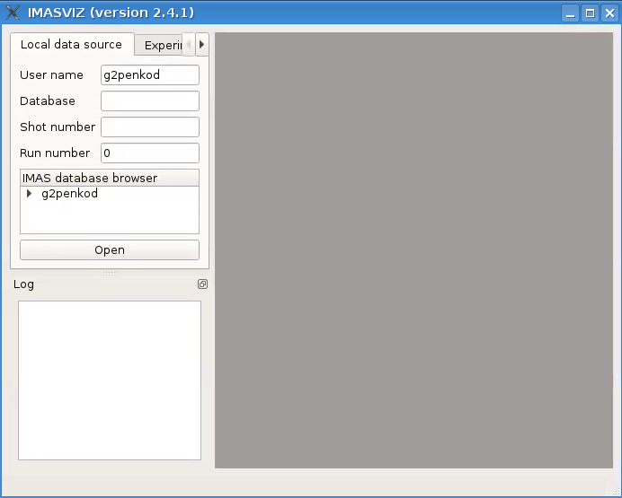

.. _getting_started:

Getting Started
===============

This section describes setting the environment configuration required
to run the IMASViz tool and how to run the application itself.

.. Running IMASViz as a module on HPC cluster
.. ------------------------------------------

.. The procedure below describes how to use IMASViz if it is available as a
.. module on the HPC cluster (e.g. GateWay).

.. Setting the Environment
.. ~~~~~~~~~~~~~~~~~~~~~~~

.. In a new terminal, execute the following command in order to load the required
.. modules:

.. .. TODO: Update for IMASViz2.0
.. .. code-block:: console

..     module load cineca
..     module load imasenv
..     module load itm-gcc/6.1.0
..     module load itm-python/3.6
..     module load itm-qt/5.8.0
..     module load imas-viz

.. Running IMASViz
.. ~~~~~~~~~~~~~~~

.. With the environment set, run the IMASviz by simply typing the following
.. command:

.. .. TODO: Update for IMASViz2.0
.. .. code-block:: console

..     viz

.. The main GUI window of IMAS_VIZ should display, as shown in the figure below:

.. .. image:: images/startup_window_default.png
..    :align: center
..    :scale: 80%

.. The description of the above input parameters is as follows:

.. +--------------------+-----------------------------------------------------------+
.. | **GUI Fields**     | **Description**                                           |
.. +====================+===========================================================+
.. | User name          | Creator/owner of the IMAS IDSs database                   |
.. +--------------------+-----------------------------------------------------------+
.. | IMAS database name | IMAS database label, usually device/machine name of the   |
.. |                    | IMAS IDS database (i. e. iter, aug, west...)              |
.. +--------------------+-----------------------------------------------------------+
.. | Shot number        | Pulse shot number                                         |
.. +--------------------+-----------------------------------------------------------+
.. | Run number         | Pulse run number                                          |
.. +--------------------+-----------------------------------------------------------+

Running IMASViz from source
---------------------------

The procedure below describes how to run IMASViz from source.

Requirements
~~~~~~~~~~~~

The fundamental requirements in order to locally run IMASViz are:

- IMAS
- Python3 and Python libraries:
   - PyQt5
   - pyqtgraph
   - matplotlib
   - Sphinx
   - Sphinx RTD theme (:command:`pip3 install sphinx_rtd_theme`)

Obtaining the source code
~~~~~~~~~~~~~~~~~~~~~~~~~

To obtain the IMASViz code source the next two steps are required:

1. Clone repository from **git.iter.org** (permissions are required!).

   Direct link to the **IMASViz** git.iter repository:
   `IMASViz <https://git.iter.org/projects/VIS/repos/viz/browse>`_.

2. Switch to IMASViz2.0 branch (required if master branch is not updated yet)

   .. code-block:: console

      git fetch # optional
      git branch -r # optional
      git checkout viz2.0_develop

Setting the environment
~~~~~~~~~~~~~~~~~~~~~~~

To set the environment, go to :file:`viz` directory and set :guilabel:`VIZ_HOME`
and :guilabel:`VIZ_PRODUCTION` environment variables by running the next
commands in the terminal:

.. code-block:: console

   cd viz
   # bash
   export VIZ_PRODUCTION=0
   export VIZ_HOME=$PWD
   # csh
   setenv VIZ_PRODUCTION 0
   setenv VIZ_HOME $PWD

Then proceed with the next instructions.

GateWay HPC
^^^^^^^^^^^

Load next modules:

.. TODO: Update for IMASViz2.0
.. code-block:: console

    module load cineca
    module load imasenv
    module load itm-gcc/6.1.0
    module load itm-python/3.6
    module load itm-qt/5.8.0
    module load imas-viz

ITER HPC
^^^^^^^^

Load next module:

.. code-block:: console

    module load IMAS/3.20.0-3.8.3

Running IMASViz
~~~~~~~~~~~~~~~

To run IMASViz, run the next commands in terminal:

.. code-block:: console

   python3 $VIZ_HOME/imasviz/VizGUI/QtVIZ_GUI.py

The main GUI window of IMAS_VIZ should display, as shown in the figure below:

The description of the above input parameters is as follows:

+--------------------+-----------------------------------------------------------+
| **GUI Fields**     | **Description**                                           |
+====================+===========================================================+
| User name          | Creator/owner of the IMAS IDSs database                   |
+--------------------+-----------------------------------------------------------+
| IMAS database name | IMAS database label, usually device/machine name of the   |
|                    | IMAS IDS database (i. e. iter, aug, west...)              |
+--------------------+-----------------------------------------------------------+
| Shot number        | Pulse shot number                                         |
+--------------------+-----------------------------------------------------------+
| Run number         | Pulse run number                                          |
+--------------------+-----------------------------------------------------------+

