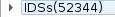
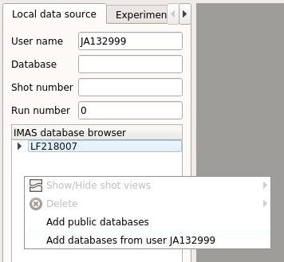

.. _loading_IDS:

Loading IDS from IMAS local data source
=======================================

This section describes and demonstrates how to load IDSs
within **IMASViz**

.. Note:: The procedure below is executed on the **GateWay HPC** and thus the
          shots in example are available on the GateWay.

Loading an IMAS IDS
-------------------

The procedure to load an IDS is as follows:

- In the main :guilabel:`IMASViz GUI`, select the first
  tab - :guilabel:`Local data source`.
- Enter the following parameters, listed below, to the appropriate text fields.

+-------------------------------+
| **IMAS IDS example**          |
+--------------------+----------+
| Parameters         | Values   |
+====================+==========+
| User name          | g2penkod |
+--------------------+----------+
| IMAS database name | viztest  |
+--------------------+----------+
| Shot number        | 52344    |
+--------------------+----------+
| Run number         | 0        |
+--------------------+----------+

The data source is a MDS+ pulse file located in
:file:`$HOME/public/imasdb/<IMAS database name>/3/0/` directory. In this
case, the :file:`~public/imasdb/viztest/3/0/` directory of user ``g2penkod``.

The filled GUI should then look as shown in the next figure:

Alternatively, the The :guilabel:`IMAS database browser` can be used to navigate
through available users databases and select it by double clicking. The
input parameters will then get filled automatically, as shown in figure below.

By typing a different user name in the :guilabel:`User name` text window and
selecting 'Add databases from user ...' from the data browser popumenu 
(obtained by a right click)  will automatically load the available databases
to the :guilabel:`IMAS database browser`.

Open an IDS
-----------

The procedure to open any IDS is the same. In this manual,
the procedure will be shown on a **magnetics IDS**.

1. Click :guilabel:`Open` button to open the IDS.

   A navigation tree window will open inside the
   **Multiple Document Interface (MDI)**, as shown in the figure below.

   .. image:: images/DTVFrame_empty.png
      :align: center
      :width: 550px

2. Press the **arrow button** |icon_arrowIDSroot|  on the left side of the
   **IDS root node**.

   This will expand the navigation :guilabel:`tree window` and display a
   list of all IDSs. The **filled IDSs** are market with With **blue** color,
   other IDSs are empty.
   The tree will allow browsing data for the specific shot number which is
   displayed by the root node ( ``IDSs(52344)`` ).

   .. image:: images/DTV_IDS_root_open.png
      :align: center
      :width: 550px

   When IDS or node label is selected the :guilabel:`Node documentation`
   widget will display the basic information (name and documentation) of
   the node, as shown below.

   .. image:: images/DTVFrame_node_doc.png
      :align: center
      :width: 550px

   The :guilabel:`Node Documentation` widget can be freely taken out from the
   main window by clicking the :guilabel:`undock` button |button_undock|
   and positioned anywhere on the screen. The same thing goes for
   the :guilabel:`Preview Plot` and :guilabel:`Log` widget.

   .. image:: images/DTVFrame_undock_example.png
      :align: center
      :width: 550px

3. Open the **magnetics IDS** by right-clicking on the **magnetics** node
   and selecting the command :guilabel:`Get magnetics data` (occurrence 0)
   as shown in the figure below.

   .. image:: images/DTV_open_magnetics_IDS.png
      :align: center
      :width: 400px

   .. Note:: Alternative: Double-clicking on the **IDS node label** ->
             **occurrence 0** (default) of the selected IDS will load.

   The magnetics IDS nodes are displayed as new nodes in the tree, as shown in
   the figure below. Nodes of an IDS are organized according to the
   **IMAS data dictionary**. Inside the **magnetics** tree, plottable
   **FLT_1D** nodes are colored blue (array length > 0).

    .. image:: images/DTV_magnetics_IDS_contents_FLT_1D.png
      :align: center
      :scale: 80%
      
Adding a new view for IDSs containing a dynamic Array Of Structure
------------------------------------------------------------------

By default, Viz opens a view displaying only one time slice, even if
more time slices have been loaded in memory during IDS loading described
above. This default view/strategy (called 'one time slice only') 
ensures to reduce the time to build the IDS tree which is displayed to 
the user. However, different views of the data can be added by 
right-clicking in the node 'Occurrence...' of the first view as shown 
in the image below.

    .. image:: images/views_menu.png
      :align: center
      :scale: 80%

The different views/strategies are:

- 'All time slices': all time slices are displayed in the tree

- 'One over 10 time slices' : only 1 slice over 10 is displayed

- 'Specific time slice only': only 1 slice is displayed with a time index choosen by the user

- 'First time slice only': this is the default view.

Below an example of 2 views of the same occurrence, the view 
'One over 10 time slices' has been added by the user.

    .. image:: images/two_views.png
      :align: center
      :scale: 80%

