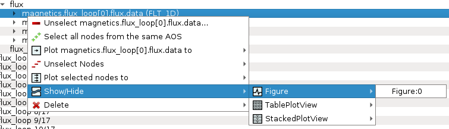

.. include:: ../icons.inc

.. _other_GUI_features:

Other GUI features
==================

Other :guilabel:`IMASViz` GUI features are listed here.

Hide/Show Plot Window
---------------------

To **hide** or **show** any of the plot windows (:guilabel:`Figure`,
:guilabel:`Table Plot View` etc.), first right-click on any
signal node. From the shown pop-up menu, select the command
:guilabel:`Show/Hide` |icon_showHide| and select the plot window you wish to
show or hide.

.. note::
   Shown plot windows will be hidden while hidden windows will be shown.

   Show/Hide plot window.

Delete Plot Window
------------------

To delete any of the plot windows, first right-click on any signal node.
From the shown pop-up menu, select the command
:guilabel:`Delete` and select the plot window you wish to delete or delete
all plot windows of certain type (:guilabel:`Figure`,
:guilabel:`Table Plot View` etc.).

.. warning::
   The plot window will be deleted permanently.

.. figure:: images/DTV_popupmenu_delete.png
   :align: center
   :scale: 75%

   Delete plot window.

Export IDS
----------

This feature allows the user to export the opened IDSs to a separate IDS with
custom parameters.

.. Note::
   Only IDSs that are currently opened and populated in the tree view window are
   exported using this feature.

.. Note::
   IMAS database (e.g. device or machine) must exist before trying to export IDS
   to it.

To export the IDSs, first navigate to the menu :guilabel:`Actions` ->
:guilabel:`Export to IDS`.

.. figure:: images/DTV_menu_export_to_IDS.png
   :align: center
   :scale: 75%

   :guilabel:`Export to IDS` feature in the menu bar.

A popup dialog will be shown where the IDS case parameters are set.

.. figure:: images/dialog_ExportToIDS.png
   :align: center
   :scale: 75%

   Empty dialog of the :guilabel:`Export to IDS` feature.

The IDS case parameters are described below:

+--------------------+-----------------------------------------------------------+
| **GUI Fields**     | **Description**                                           |
+====================+===========================================================+
| User name          | Creator/owner of the IMAS IDSs database                   |
+--------------------+-----------------------------------------------------------+
| IMAS database name | IMAS database label, usually device/machine name of the   |
|                    | IMAS IDS database (i. e. iter, aug, west...)              |
+--------------------+-----------------------------------------------------------+
| Shot number        | Pulse shot number                                         |
+--------------------+-----------------------------------------------------------+
| Run number         | Pulse run number                                          |
+--------------------+-----------------------------------------------------------+

When the case parameters are set, press the :guilabel:`OK` button to export to
the specified new IDS.

   :guilabel:`Export to IDS` feature dialog with set parameters.

The export status gets displayed in the tree view log widget.

.. figure:: images/ExportToIDS_log_success.png
   :align: center
   :scale: 75%

   :guilabel:`Export to IDS` finish message.
