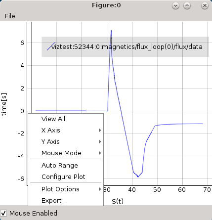
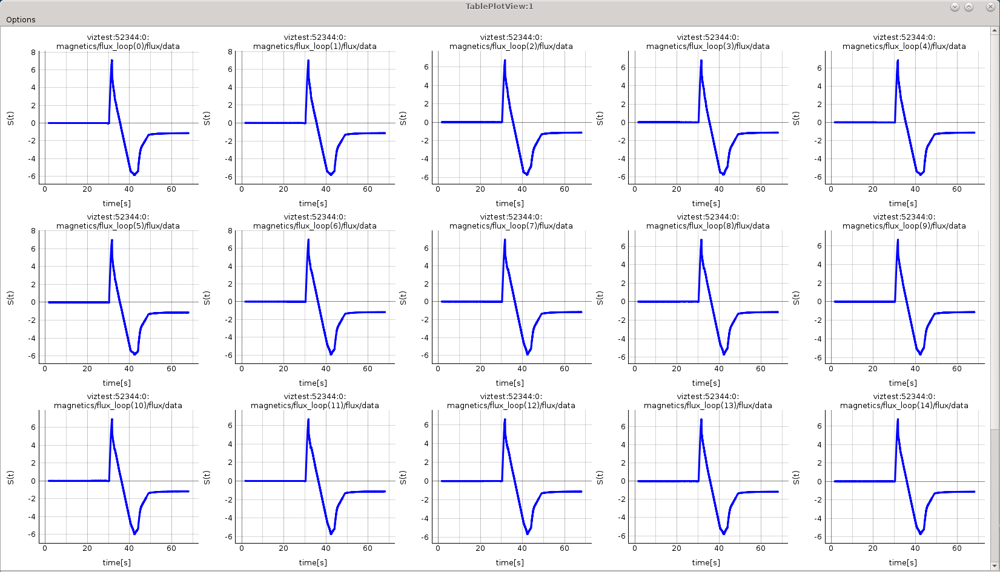
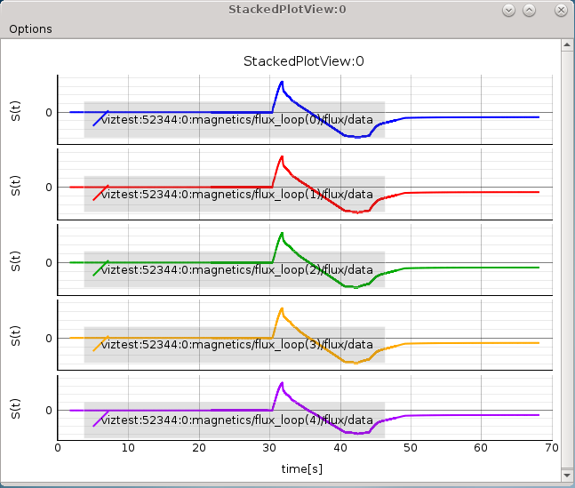

.. include:: ../icons.inc

.. _plotting_1d_arrays:

Plotting 1D arrays
==================

The plotting of 1D arrays option and plot handling is one of the main features
of the IMASViz.

This tutorial subsection presents the basics of plotting a 1D array, stored in
the IDS, and how to handle the created plots.

Plotting a single 1D array to plot figure
-----------------------------------------

The procedure to plot 1D array is as follows:

1. Navigate through the **magnetics IDS** and search for the node containing
   **FLT_1D** data, for example **ids.magnetics.flux_loop[0].flux.data**.
   Plottable FLT_1D nodes are colored blue (array length > 0)

   .. figure:: images/DTV_magnetics_IDS_contents_FLT_1D.png
     :align: center
     :scale: 80%
     :alt: FLT_1D plot

     Example of plottable FLT_1D node.

   By clicking on the node the preview plot will be displayed in the
   :guilabel:`Preview Plot`, located in the main browsing window. This
   feature helps to quickly check how the data, stored in the FLT_1D, looks
   when plotted.

   .. figure:: images/DTV_preview_plot.png
     :align: center
     :scale: 80%

     Preview Plot

2. Right-click on the **ids.magnetics.flux_loop[0].flux.data (FLT_1D)** node

3. From the pop-up menu, select the command
   :guilabel:`Plot ids.magnetics.flux_loop[0].flux.data to` |icon_plotSingle| ->
   :guilabel:`figure` |icon_Figure| -> :guilabel:`New` |icon_new|.

   .. figure:: images/DTV_popupmenu_plotting_single_plot.png
     :align: center
     :scale: 80%

     Navigating through right-click menu to plot data to plot figure.

   The plot should display in plot figure as shown in the image below.

   .. figure:: images/plotWidget_basic.png
     :align: center
     :scale: 75%

     Basic plot figure display.

Basic plot display features
~~~~~~~~~~~~~~~~~~~~~~~~~~~

The below features are available for any :guilabel:`plot display`. Most of them
are available in the right-click menu.

.. Note::
   Term :guilabel:`Plot Display` is used for any base window for displaying
   plots. Following that the :guilabel:`Plot Figure` contains a single
   :guilabel:`Plot Display`, while :guilabel:`Table Plot View`
   and :guilabel:`Stacked Plot View` consist of multiple
   :guilabel:`Plot Displays`.

  Plot display window right-click menu.

.. Disable/Enable Mouse
.. ^^^^^^^^^^^^^^^^^^^^

.. Allows enabling or disabling mouse.
.. This feature can ticked on/off on bottom left corner

View All
^^^^^^^^

View whole plot area.

   .. figure:: images/plotDisplay_popupmenu_viewAll.png
     :align: center
     :scale: 75%

     :guilabel:`View All` feature in the right-click menu.

Auto Range
^^^^^^^^^^

Similar to :guilabel:`View All` feature with the difference that it shows
plot area between values ``X_min`` -> ``X_max`` and ``Y_min`` -> ``Y_max``,
without 'plot margins'.

   .. figure:: images/plotDisplay_popupmenu_autoRange.png
     :align: center
     :scale: 75%

     :guilabel:`Auto Range` feature in the right-click menu.

Left Mouse Button Mode Change
^^^^^^^^^^^^^^^^^^^^^^^^^^^^^

Change between :guilabel:`Pan Mode` (move plot around) and
:guilabel:`Area Zoom Mode` (choose selectable area to zoom into).

   .. figure:: images/plotDisplay_popupmenu_mouseMode.png
     :align: center
     :scale: 75%

     :guilabel:`Mouse Mode` feature in the right-click menu.

Axis options
^^^^^^^^^^^^

X and Y axis range, inverse, mouse enable/disable options and more.

   .. figure:: images/plotDisplay_popupmenu_axisOptions.png
     :align: center
     :scale: 75%

     :guilabel:`Axis Options` feature in the right-click menu.

Plot Configuration and Customization
^^^^^^^^^^^^^^^^^^^^^^^^^^^^^^^^^^^^

Setting color and line properties of plots shown in the Plot Display.

   .. figure:: images/plotDisplay_popupmenu_configurePlot.png
     :align: center
     :scale: 75%

     :guilabel:`Configure Plot` feature in the right-click menu.

Each plot can be customized. By selecting this feature a separate GUI window
will open, listing all plots within the plot display window and their
properties that can be customized.

   .. figure:: images/plotDisplay_configurePlot_window.png
     :align: center

     :guilabel:`Configure Plot` GUI.

   .. figure:: images/plot_configuration_example.png
     :align: center

     Plot configuration example.

Plot options
^^^^^^^^^^^^

Enable/Disable grid, log scale and more.

   .. figure:: images/plotDisplay_popupmenu_plotOptions.png
     :align: center
     :scale: 75%

     :guilabel:`Plot Options` feature in the right-click menu.

Export feature
^^^^^^^^^^^^^^

The Plot Display scene can be exported to:
- image file (PNG, JPG, ...). A total of 16 image formats are supported.
- scalable vector graphics (SVG)
- matplotlib window
- CSV
- HDF5

   .. figure:: images/plotDisplay_popupmenu_export.png
     :align: center
     :scale: 75%

     :guilabel:`Export` feature in the right-click menu.

   .. figure:: images/plotDisplay_export_window.png
     :align: center
     :scale: 75%

     Export GUI window.

   .. figure:: images/plotDisplay_export_matplotlib.png
     :align: center
     :scale: 75%

     Comparison of IMASViz :guilabel:`Plot Figure` and
     :guilabel:`matplotlib window`

.. _add_plot_to_existing_figure_:

Adding a plot to an existing figure
-----------------------------------

The procedure of adding a plot to an already existing figure is as follows:

1. From the previous navigation tree, navigate to the wanted node, for example
   **ids.magnetics.flux_loop[16].flux.data**

2. Right-click on the node.

3. From the pop-up menu, navigate and select
   :guilabel:`Plot <node name> to` |icon_plotSingle| ->
   :guilabel:`Figure` |icon_Figure| -> :guilabel:`Figure:0`

   .. figure:: images/DTV_popupmenu_plot_to_existing_figure.png
     :align: center
     :scale: 75%

     Plotting to existing figure.

The plot will be added to the existing plot as shown in the image below.

   .. figure:: images/DTV_popupmenu_plot_to_existing_figure_result.png
     :align: center
     :scale: 75%

     Plotting to existing figure - result.

Comparing plots between two IDS databases
-----------------------------------------

IMASViz allows comparing of FLT_1D arrays between two different IDS databases
(different shots too). The procedure is very similar to the one presented in
the section :ref:`add_plot_to_existing_figure_`:

1. Open another IMAS database, same as shown in section :ref:`loading_IDS`.
   In this manual this will be demonstrated using IDS with :guilabel:`shot`
   parameter **52682**.

   +-------------------------+-----+
   | **Manual IDS case**           |
   +--------------------+----------+
   | parameters         | values   |
   +--------------------+----------+
   | User name          | g2penkod |
   +--------------------+----------+
   | IMAS database name | viztest  |
   +--------------------+----------+
   | Shot number        | 52682    |
   +--------------------+----------+
   | Run number         | 0        |
   +--------------------+----------+

2. Load occurrence 0 of **magnetics** IDS

3. Navigate through the IDS search for the wanted node, for example
   **ids.magnetics.flux_loop[0].flux.data**.

4. Right-click on the node.

5. From the pop-up menu, navigate and select
   :guilabel:`Plot <node name> to` |icon_plotSingle| ->
   :guilabel:`Figure` |icon_Figure| -> :guilabel:`Figure:0`

The plot will be added to the existing plot as shown in the image below.

   .. figure:: images/DTV2_popupmenu_plot_to_existing_figure_result.png
     :align: center
     :scale: 75%

     Plotting from other IDS to existing figure - result.

.. _plotting_a_selection_to_figure:

Plotting a selection of 1D arrays to figure - Introduction to node selection feature
------------------------------------------------------------------------------------

IMASViz offers the user the ability to set or mark a selection of plottable
arrays (nodes) as once. This way plotting multiple plots to a
:guilabel:`Figure` or to a :guilabel:`MultiPlot View` is more convenient
and faster, avoiding "one-by-one" plotting.

.. Note::
   For MultiPlotView features please see section :ref:`multiplot_features`.

The procedure of 1D arrays selection and plotting to the same figure is as
follows:

1. Navigate to the node.

2. Right-click on the node.

3. Select node arrays. This can be done in the next two ways.

   - Select nodes one-by-one:

      a. From the pop-up menu, select the command
         :guilabel:`Select <node name>`.

         .. figure:: images/DTV_popupmenu_select.png
           :align: center
           :scale: 75%

           Selecting plottable node.

         The selected node label gets colored into red.

         .. figure:: images/DTV_node_red.png
           :align: center
           :scale: 75%

           Node colored red -> node is selected.

      b. Repeat steps 1., 2., and 3. until all wanted nodes are selected.

         .. figure:: images/DTV_node_selection.png
           :align: center
           :scale: 75%

           Example of multiple nodes selection.

         .. Note::
            At the same time, nodes from other opened IDS databases too can be
            selected.

   - Select all arrays of the same structure (AOS) (same node structure type):

     a. From the pop-up menu, select the command
        :guilabel:`Select All Nodes From The Same AOS`.

        .. figure:: images/DTV_popupmenu_select_AOS.png
          :align: center
          :scale: 75%

          Selecting plottable nodes of the same structure/type.

        The selected nodes label gets colored into red.

        .. figure:: images/DTV_node_selection_AOS.png
          :align: center
          :scale: 75%

          Node colored red -> node is selected. All plottable nodes of the
          same structure/type are selected, in this case 17 nodes.

4. When finished with node selection, either:
   - right-click on any FLT_1D node, or
   - click :guilabel:`Node Selection` menu on menubar of the main tree view
   window.

5. From the pop-up menu, navigate and select
   :guilabel:`Plot selected nodes to` |icon_plotMultiple| ->
   :guilabel:`Figure` |icon_Figure| -> :guilabel:`New` |icon_new|->
   :guilabel:`This IMAS database` |icon_thisDTV|.

   .. Note::
      The same procedure applies plotting the selection to an existing figure.

   .. figure:: images/DTV_popupmenu_plot_selected_nodes_to_figure_thisDTV.png
     :align: center
     :scale: 75%

     Plotting selection to a new figure using selection from the currently
     opened IDS database.

   .. figure:: images/DTV_plot_selected_nodes_to_figure_thisDTV_result.png
     :align: center
     :scale: 75%

     Example of plot figure, created by plotting data from node selection.

.. _multiplot_features:

MultiPlot features
------------------

IMASViz provides few features that allow plotting a selection of plottable
arrays to a single plot view window.

Currently there are two such features available:
- :guilabel:`Table Plot View` and
- :guilabel:`Stacked Plot View`.

Each of those Plot Views feature its own plot display layout and plot display
window interaction features.

.. Note::
   In the old IMASViz the :guilabel:`Table Plot View` is known as
   :guilabel:`MultiPlot` and the :guilabel:`Stacked Plot View` is known as
   :guilabel:`SubPlot`. The decision to rename those features was made due to
   the previous names not properly describing the feature itself and both of
   those features being a form of 'MultiPlot'.

.. _TPV:

Table Plot View
~~~~~~~~~~~~~~~

Table Plot View plots every array from selection to its own plot display.
The plot display are arranged to resemble a table layout, as shown in figure
below.

    MultiPlot - :guilabel:`Table Plot View` Example.

Creating new view
^^^^^^^^^^^^^^^^^

To create a new :guilabel:`Table Plot View`, follow the next steps:

1. Create a selection of nodes, as described in section
   :ref:`plotting_a_selection_to_figure`.

2. When finished with node selection, either:
   - right-click on any FLT_1D node or
   - click :guilabel:`Node Selection` menu on menubar of the main tree view
   window.

3. From the pop-up menu, navigate and select
   :guilabel:`Plot selected nodes to` |icon_plotMultiple| ->
   :guilabel:`TablePlotView` |icon_TablePlotView| -> :guilabel:`New` |icon_new|->
   :guilabel:`This IMAS database` |icon_thisDTV| or
   :guilabel:`All IMAS databases` |icon_allDTV| or.

   .. figure:: images/DTV_plot_selected_nodes_to_TPV_thisDTV.png
     :align: center
     :scale: 75%

     Plotting selection to a new figure using selection from the currently
     opened IDS database.

   The :guilabel:`Table Plot View` window will then be shown.

.. note::
   Scrolling down the :guilabel:`Table Plot View` window using the middle mouse
   button is disabled as the same button is used to interact with the plot
   display (zoom in and out). Scrolling can be done by clicking the scroll bar
   on the right and dragging it up and down.

Save MultiPlot configuration
^^^^^^^^^^^^^^^^^^^^^^^^^^^^

MultiPlot configuration (currently available only for
:guilabel:`Table Plot View` feature) allows the user to save the MultiPlot
session and load it later.

To create MultiPlot configuration, follow the next steps:

1. Create a selection of nodes, as described in section
   :ref:`plotting_a_selection_to_figure`.

2. Create a :guilabel:`Table Plot View`, as described in :ref:`TPV`.

3. In :guilabel:`Table Plot View` menubar navigate to **Options** ->
   **Save Plot Configuration**

   .. figure:: images/SavePlotConfiguration_dialog.png
     :align: center
     :scale: 75%

     Save Plot Configuration Dialog Window.

4. Type configuration name in the text area.

5. Press **OK**.

.. Note::
   The configurations are saved to ``$HOME/.imasviz`` folder.

Load MultiPlot configuration
^^^^^^^^^^^^^^^^^^^^^^^^^^^^

To load MultiPlot configuration, follow the next steps:

1. In Main Tree View Window menu navigate to **Actions** ->
   **Apply Plot Configuration**

   .. figure:: images/ApplyPlotConfiguration_window.png
     :align: center
     :scale: 75%

     Apply Plot Configuration GUI Window.

2. Select the configuration from the list.

3. Press **Apply selection and plot selected data**.

   The :guilabel:`Table Plot View` will be created using the data stored in the
   configuration file.

.. Note::
   Currently this feature will take all plot data from single (currently)
   opened IMAS database, event though MultiPlot configuration was made using
   plots from multiple IMAS databases at once. This feature is to be improved
   in the future.

Stacked Plot View
~~~~~~~~~~~~~~~~~

Stacked Plot View plots every array from selection to its own plot display.
The plot display are arranged to resemble a stack layout, as shown in figure
below.

    MultiPlot - :guilabel:`Stacked Plot View` Example.

Creating new view
^^^^^^^^^^^^^^^^^

To create a new :guilabel:`Stacked Plot View`, follow the next steps:

1. Create a selection of nodes, as described in section
   :ref:`plotting_a_selection_to_figure`.

2. When finished with node selection, either:
   - right-click on any FLT_1D node or
   - click :guilabel:`Node Selection` menu on menubar of the main tree view
   window.

3. From the pop-up menu, navigate and select
   :guilabel:`Plot selected nodes to` |icon_plotMultiple| ->
   :guilabel:`StackedPlotView` |icon_StackedPlotView| ->
   :guilabel:`New` |icon_new|->
   :guilabel:`This IMAS database` |icon_thisDTV| or
   :guilabel:`All IMAS databases` |icon_allDTV| or.

   .. figure:: images/DTV_plot_selected_nodes_to_SPV_thisDTV.png
     :align: center
     :scale: 75%

     Plotting selection to a new figure using selection from the currently
     opened IDS database.

   The :guilabel:`Stacked Plot View` window will then be shown.

