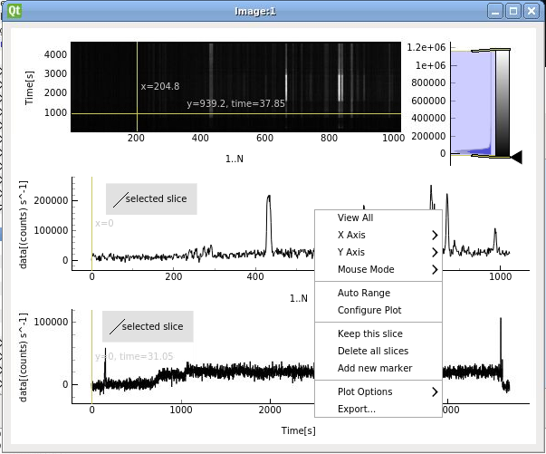

..
   Copyright holders : Commissariat à l’Energie Atomique et aux Energies Alternatives (CEA), France;
   and Laboratory for Engineering Design - LECAD, University of Ljubljana, Slovenia
   CEA and LECAD authorize the use of the METIS software under the CeCILL-C open source license https://cecill.info/licences/Licence_CeCILL-C_V1-en.html
   The terms and conditions of the CeCILL-C license are deemed to be accepted upon downloading the software and/or exercising any of the rights granted under the CeCILL-C license.

.. include:: ../icons.inc

.. _plotting_2d_arrays:

Plotting 2D arrays
==================

This section describes the basics of plotting a 2D array stored in
an IDS and introduce new features available for 2D plots.

.. _plotting_single_2d_array:

Plotting a single 2D array
--------------------------

The procedure to plot 2D array is as follows:

1. Navigate through an IDS and search for a node containing
   **FLT_2D** data. Below is an example based on a WEST shot (54178, run=0). 
   The node **spectrometer_visible.channel[101].grating_spectrometer.intensity_spectrum.data** has been 
   selected.
   Plottable FLT_2D nodes are colored **blue** (2D data array shapes > 0).

   By clicking on the node a preview plot will be displayed as a black and white 2D image:
   
   .. figure:: images/2D_image_preview.png
     :align: center
     :scale: 80%
     :alt: FLT_2D plot

2. Right-click on the node.

3. From the pop-up menu, select the command
   :guilabel:`Plot spectrometer_visible.channel[101].grating_spectrometer.intensity_spectrum.data to` |icon_plotSingle| ->
   :guilabel:`image` |icon_Figure| -> :guilabel:`New` |icon_new|.

   .. figure:: images/2D_DTV_popupmenu_plotting_image.png
     :align: center
     :width: 550px

   The image plot should display as shown in the image below.

   .. figure:: images/2D_image_plotwidget.png
     :align: center
     :scale: 80%

2D plot features
~~~~~~~~~~~~~~~~

The 2D plot component contains an image representing the 2D data and 2 basic 1D plots representing
image slices along X (horizontal direction) and Y (vertical direction).
When 2D data has a time axis, this one is always represented in the Y direction on the image.

Line segments ROI are present on the image, one to select a data slice along the X direction and another
one for the Y direction. Slices are plotted on 1D plots below the image.
Each ROI displays also the position (x or y) of the X-slice or Y-slice of the image.
When 2D data has a time axis, the vertical ROI will also display the corresponding time in seconds (IMAS uses
SI units).

By default, each slice 1D plot contains a movable marker to indicate a specific position on the 1D curve.
When 2D data has a time axis, 1D slice markers display also the time for a given location along Y.
 
All 2D plot features are available in the right-click menu on the image and on each 1D plot.

Below are described only the new features available in 2D, all others features are already described in the documentation section for 1D plots, "Plotting 1D arrays".

Keep this slice
^^^^^^^^^^^^^^^

The current selected slice will be kept in the corresponding 1D plot. This feature allows to compare different
slices. Each time a slice is added on the plot, a new label is created indicating the position of the slice.
If the slice is along the time axis, the time of the slice is also displayed in the label.

Delete all slices
^^^^^^^^^^^^^^^^^

Removed all slices previously appended using the menu command 'Keep this slice'.

Add a new marker
^^^^^^^^^^^^^^^^

Add a new marker to the plot.

