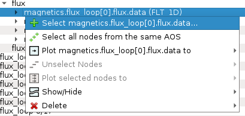
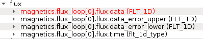
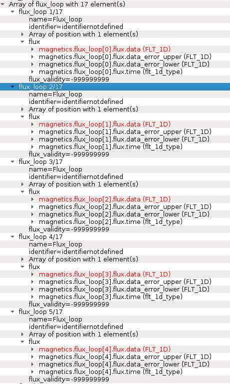
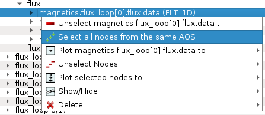
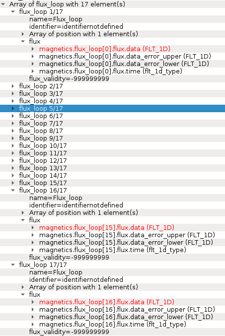

.. include:: ../icons.inc

.. _signal_node_selection:

Node selection
==============

IMASViz offers the user the ability to set or mark a selection of plottable
arrays (nodes) as once. This way plotting multiple plots to the same
:guilabel:`Figure` or to a :guilabel:`MultiPlot View` is more convenient
and faster, avoiding "one-by-one" plotting.

.. Note::
   How to plot selection is described later in section
   :ref:`plotting_1d_arrays`.

In the continuation of this section different methods of node selection are
described.

Select One-by-one
-----------------

To select nodes customly one by one, first right-click on the wanted node.
From the shown pop-up menu, select the command :guilabel:`Select <node name>`.

   Selecting plottable node.

The selected node label gets colored into red.

   Node colored red -> node is selected.

Repeat that procedure until all wanted nodes are selected.

   Example of multiple nodes selection.

.. Note::
   At the same time, nodes from other opened IDS databases too can be
   selected.

Select All Nodes of the same Structure (AOS)
--------------------------------------------

To select all nodes of the same structure (same node structure type),
right-click on one of the nodes and from the shown popup-menu select the option
:guilabel:`Select All Nodes From The Same AOS`.

   Selecting plottable nodes of the same structure/type.

All nodes of the same structure will be selected and their label will be
colored to red.

   Node colored red -> node is selected. All plottable nodes of the
   same structure/type are selected, in this case 17 nodes.

Save Node Selection Configuration
---------------------------------

...

Load Selection From Save Node Selection Configuration
------------------------------------------------------

...

Load Selection From MultiPlot Configuration
--------------------------------------------

...

