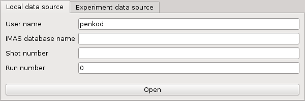

.. _getting_started:

Getting Started
===============

This tutorial subsection presents setting the environment configuration required
to run the IMASViz tool and how to run the application itself.

Setting the Environment
-----------------------

In a new terminal, execute the following command in order to load the required
modules:

.. TODO: Update for IMASViz2.0
.. code-block:: console

    module load cineca
    module load imasenv/
    module load imas-viz

Running IMASViz
---------------

With the environment set, run the IMASviz by simply typing the following
command:

.. TODO: Update for IMASViz2.0
.. code-block:: console

    viz

The main GUI window of IMAS_VIZ should display, as shown in the figure below:

The description of the above input parameters is as follows:

+--------------------+-----------------------------------------------------------+
| **GUI Fields**     | **Description**                                           |
+====================+===========================================================+
| User name          | Creator/owner of the IMAS IDSs database                   |
+--------------------+-----------------------------------------------------------+
| IMAS database name | IMAS database label, usually device/machine name of the   |
|                    | IMAS IDS database (i. e. iter, aug, west...)              |
+--------------------+-----------------------------------------------------------+
| Shot number        | Pulse shot number                                         |
+--------------------+-----------------------------------------------------------+
| Run number         | Pulse run number                                          |
+--------------------+-----------------------------------------------------------+
